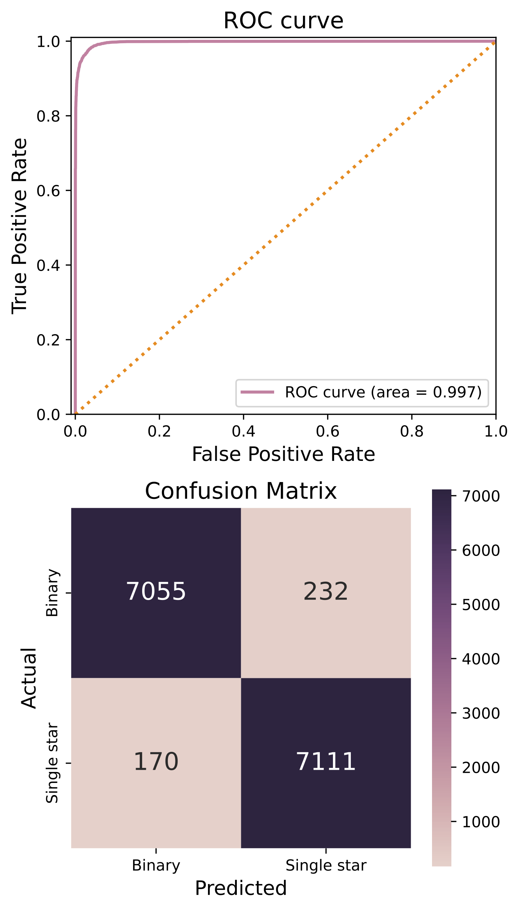

# Unresolved-Wide-Binaries

This project includes an end-to-end pipeline for training a model to detect unresolved wide binaries from photometric data. The pipeline includes data loading, augmentation, model training, and evaluation. By default, the pipeline uses EfficientNet-B3a as the backbone of the model, a pre-trained convolutional neural network that is highly efficient and accurate. 


### How to Use

You can use this pipeline by running the script from the command line and specifying the path to your data as well as optional batch size and number of workers. Here is an example command:

```shell
python main.py --data_path /path/to/your/data --bs 64 --num_workers 4
```
In this command:

- `--data_path` is the path to the directory containing your data.
- `--bs` is the batch size for training the model (default is 64).
- `--num_workers` is the number of worker threads to use for data loading (default is 4).
### Output
After training, the model produces ROC curves and confusion matrix plots to visualize its performance.


